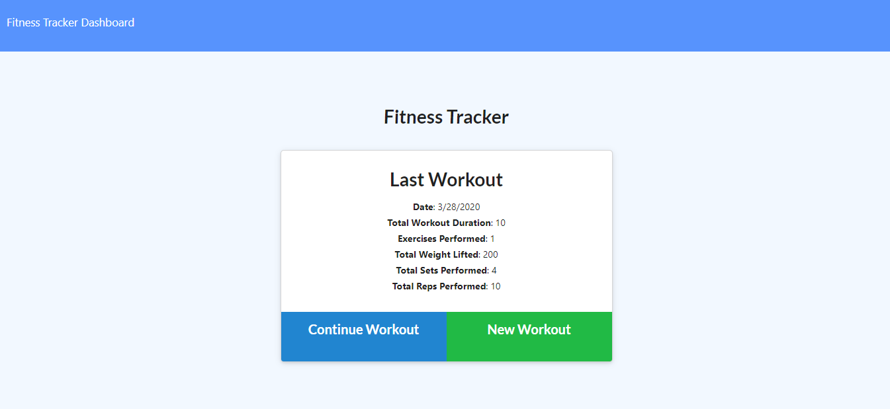
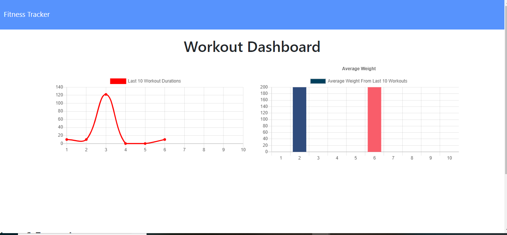

# Nosql-Workout-Tracker

- [User Story](#User-Story)
- [General Info](#General-Info)
- [Instructions](#Instructions)
- [Motivation](#Motivation)
- [Future Functionality](#Future-Functionality)
- [References](#References)

## User Story

As a user,
I want to be able to view create and track daily workouts.
I want to be able to log multiple exercises in a workout on a given day.
I should also be able to track the name, type, weight, sets, reps, and duration of exercise.
If the exercise is a cardio exercise, I should be able to track my distance traveled.

## General-Info

This Fitness Tracker App gives the user the option to enter in a custom workout, and see their results over time when comparing past workout insertions. The interface was completed beforehand as part of the homework assignment, and as a coder my contribution was completing the backend section. This section of the application features a MongoDB" workout schema and an extensive Routes.js page. I focused on implementing the CRUD routes for Mongoose and ensuring that everything worked and pages communicated smoothly with each other. This assignment was good for me to continue practricing on the backend and will help setup a good foundation for future projects.

## Instructions

To successfully run this application, the user should first clone the repository into a local file and run npm install. Using the local console, user will run "npm i" on the included dependencies such as "npm i express." After, run "npm run start" and on your local browser, type in "localhost:3000." This will bring up the UX where new workouts can be entered. After specifying workout critera, hit "Complete workout." Then, user can click "Fitness Tracker Dashboard" to view stats on their past workouts.

## Motivation

This project helped me to practice MongoDB and Mongoose schemas which were two new concepts learned this past week. Focusing my efforts on backend functionality and learning the syntax of JavaScript routes. I benefitted from the increased practice on NoSql and pushing projects to Heroku.

## Future Functionality

For the future adding various aspects and addons to Chart.js would be helpful, especially for someone using this application consistently. More practice on routes and syncing up database information would also help expand the application.

## References

https://www.youtube.com/watch?v=yUsxRaOYVG4&feature=youtu.be
https://www.youtube.com/watch?v=2E8eWUHJaNg&feature=youtu.be&list=PLOFmg4xbN_TPrB6w4rThsFanVxJI_SfER
https://coursework.vschool.io/mongoose-crud/
https://htmlcheatsheet.com/jquery/
